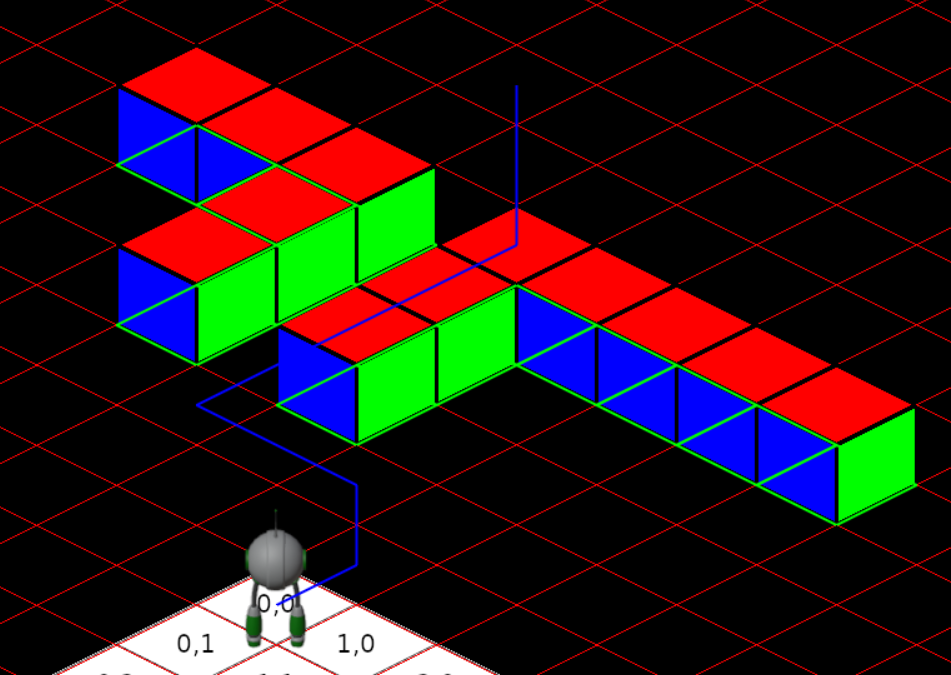
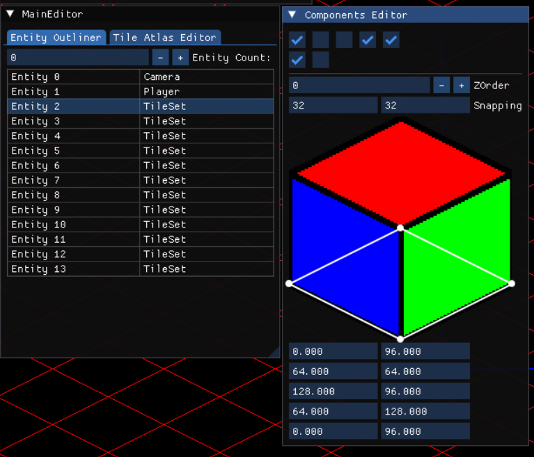

# Engine²
Engine² is a 2D sprite engine, named after the fact it's an engine with 2-dimensions.

For PNG support with sdl_image the package additionally requires: "libpng", "zlib",

# Building
Using an appropriate version of CMake:
``cmake -B ./build`` to generate the project build system. 
``cmake --build ./build/`` to build the project. 

CMake will handle all dependencies through creating a copy of VCPKG, and utilising that as a package manager.

## Core
Wrappers for memory safety, primarily of SDL functionality to implement Resoure Accquisition Is Initialisation (RAII).

## Input
To avoid hardcoding inputs it was neccesary to have an abstraction layer above the SDL event loop. This is done with the ``Action`` class, which encapsulates a behaviour and the inputs which cause it.

The ``Action`` class stores a mapping of an input’s name to a representation of its state, ``RawInput``. This wrapper class is updated as its value and state changes on press or release in the event loop, and then when the ``Action`` instance processes all its bound ``RawInput``s, the value will be altered depending on the ``RawInput``'s attached modifiers and conditions.

Depending on the desired values from an input, the ``Action`` class will store an appropriate representation, e.g. A boolean value of a key press as a right facing vector. It will also combine multiple bound inputs if desired, allowing for a seamless combination of mouse, keyboard, and controller.

## EntityComponentSystem
Utilising a data-oriented design, objects are managed using an entity-component-system. Each component is stored contiguously in a memory pool, encapsulated by an entity manager to make retrieving specific components simple. 

These components are operated on by systems which are implemented using inheritence, but as they are only called once a frame any virtual overhead should be minimal.

## SceneManagement
Contains the scenes and their manager. These are all derived from a "BaseScene" so that they can be managed by a map and accessed indiscriminately. Most virtual overhead should be neglible as they are typically called once per scene update, but some of the getters and conversion methods might have an impact if called too much.

Some parrallelisation is setup using a thread pool.

The primary scene used is an isometric scene, which contains helper functions for converting points to and from and isometric grid.

## Editor
Using Dear ImGui, the editor is implemented through template metaprogramming to handle the differing types of components.

### Commands
The Command pattern is utilisedd to implement a redo/undo system in the editor.

## Data
Contains all the data that needs to be loaded at runtime; textures, fonts, etc.

This folder is copied on build to the executable's directory.

Engine² = (Engine)(Engine) = EEnnggiinnee != eennggiinnee
